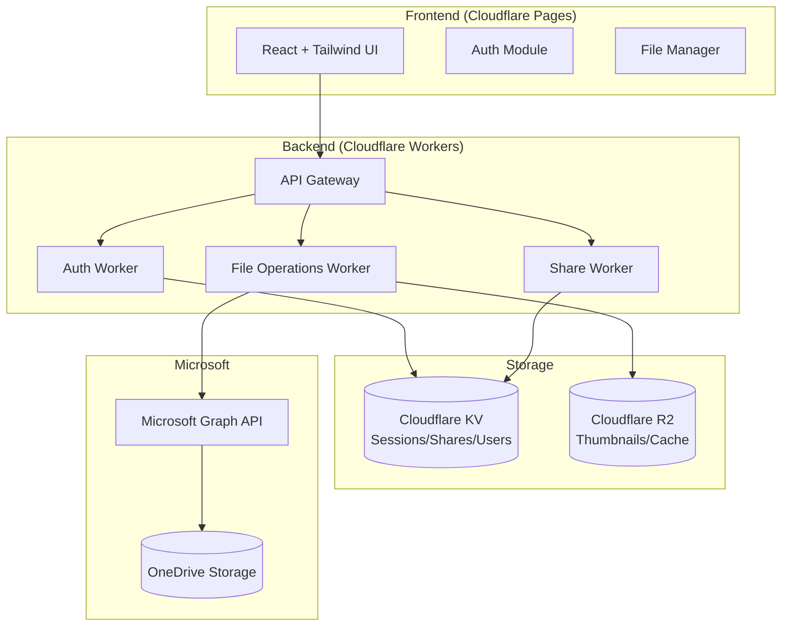
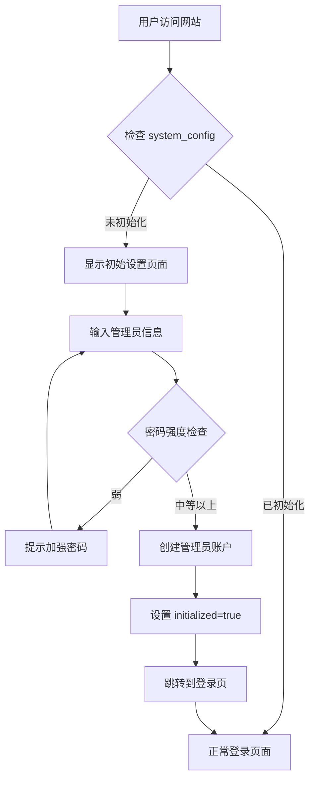

# CFDrive 云盘应用实现计划

基于 Cloudflare Workers & Pages 的云盘应用，后端存储使用 OneDrive (Microsoft Graph API)，前端采用 React + Tailwind CSS。

## 系统架构



---

## 用户角色与权限模型

| 角色 | 权限描述 | 权限代码 |
|------|----------|----------|
| **SuperAdmin** | 所有文件夹/文件的完全控制权 | `*:*` |
| **Collaborator** | 指定文件夹的增删改查权限 | `folder_id:crud` |
| **Customer** | 指定文件夹的查看和下载权限 | `folder_id:rd` |
| **Guest** | 仅访问公开分享的内容 | `share:r` |

---

## 技术栈

| 层级 | 技术选型 | 说明 |
|------|----------|------|
| **前端框架** | React 18 + TypeScript | SPA 应用 |
| **样式** | Tailwind CSS 3 | 响应式设计 + 深色模式 |
| **状态管理** | Zustand | 轻量级状态管理 |
| **路由** | React Router 6 | 前端路由 |
| **构建工具** | Vite | 快速开发构建 |
| **后端运行时** | Cloudflare Workers | Serverless 边缘计算 |
| **数据存储** | Cloudflare KV | 用户/会话/分享数据 |
| **文件缓存** | Cloudflare R2 | 缩略图等静态资源 |
| **文件存储** | OneDrive (Graph API) | 实际文件存储 |
| **测试框架** | Vitest | 单元测试 |

---

## 数据库设计 (Cloudflare D1)

> [!NOTE]
> 使用 Cloudflare D1 (SQLite 兼容) 存储用户、权限、分享等关系型数据。文件本身存储在 OneDrive。

### 表结构

```sql
-- ============================================
-- 系统配置表 (用于首次安装检测)
-- ============================================
CREATE TABLE IF NOT EXISTS system_config (
    key TEXT PRIMARY KEY,
    value TEXT NOT NULL,
    created_at TEXT DEFAULT (datetime('now')),
    updated_at TEXT DEFAULT (datetime('now'))
);

-- 初始化标记: 检查 key='initialized' 判断是否首次安装

-- ============================================
-- 用户表
-- ============================================
CREATE TABLE IF NOT EXISTS users (
    id TEXT PRIMARY KEY,                    -- UUID
    email TEXT UNIQUE NOT NULL,             -- 邮箱 (可用于登录)
    username TEXT UNIQUE NOT NULL,          -- 用户名
    password_hash TEXT NOT NULL,            -- bcrypt 加密的密码
    display_name TEXT,                      -- 显示名称
    role TEXT NOT NULL DEFAULT 'guest',     -- 角色: superadmin/collaborator/customer/guest
    status TEXT NOT NULL DEFAULT 'active',  -- 状态: active/disabled
    avatar_url TEXT,                        -- 头像 URL
    last_login_at TEXT,                     -- 最后登录时间
    created_at TEXT DEFAULT (datetime('now')),
    updated_at TEXT DEFAULT (datetime('now'))
);

-- 创建索引
CREATE INDEX IF NOT EXISTS idx_users_email ON users(email);
CREATE INDEX IF NOT EXISTS idx_users_role ON users(role);

-- ============================================
-- 用户会话表
-- ============================================
CREATE TABLE IF NOT EXISTS sessions (
    id TEXT PRIMARY KEY,                    -- Session ID
    user_id TEXT NOT NULL,                  -- 关联用户
    token_hash TEXT NOT NULL,               -- Token 哈希
    ip_address TEXT,                        -- 登录 IP
    user_agent TEXT,                        -- 浏览器信息
    expires_at TEXT NOT NULL,               -- 过期时间
    created_at TEXT DEFAULT (datetime('now')),
    FOREIGN KEY (user_id) REFERENCES users(id) ON DELETE CASCADE
);

CREATE INDEX IF NOT EXISTS idx_sessions_user ON sessions(user_id);
CREATE INDEX IF NOT EXISTS idx_sessions_expires ON sessions(expires_at);

-- ============================================
-- 文件夹权限表 (用于 Collaborator/Customer 的细粒度权限)
-- ============================================
CREATE TABLE IF NOT EXISTS folder_permissions (
    id TEXT PRIMARY KEY,
    user_id TEXT NOT NULL,                  -- 用户 ID
    folder_id TEXT NOT NULL,                -- OneDrive 文件夹 ID
    folder_path TEXT NOT NULL,              -- 文件夹路径 (便于显示)
    permission TEXT NOT NULL,               -- 权限: crud (全部) / rd (读+下载) / r (只读)
    granted_by TEXT NOT NULL,               -- 授权人 ID
    created_at TEXT DEFAULT (datetime('now')),
    FOREIGN KEY (user_id) REFERENCES users(id) ON DELETE CASCADE,
    FOREIGN KEY (granted_by) REFERENCES users(id)
);

CREATE INDEX IF NOT EXISTS idx_permissions_user ON folder_permissions(user_id);
CREATE INDEX IF NOT EXISTS idx_permissions_folder ON folder_permissions(folder_id);
CREATE UNIQUE INDEX IF NOT EXISTS idx_permissions_unique ON folder_permissions(user_id, folder_id);

-- ============================================
-- 分享链接表
-- ============================================
CREATE TABLE IF NOT EXISTS shares (
    id TEXT PRIMARY KEY,                    -- 分享 ID
    code TEXT UNIQUE NOT NULL,              -- 短链接代码 (6-8位)
    file_id TEXT NOT NULL,                  -- OneDrive 文件/文件夹 ID
    file_path TEXT NOT NULL,                -- 文件路径
    file_type TEXT NOT NULL,                -- file / folder
    created_by TEXT NOT NULL,               -- 创建者 ID
    password_hash TEXT,                     -- 访问密码 (可选)
    expires_at TEXT,                        -- 过期时间 (可选)
    max_downloads INTEGER,                  -- 最大下载次数 (可选)
    download_count INTEGER DEFAULT 0,       -- 已下载次数
    view_count INTEGER DEFAULT 0,           -- 访问次数
    is_active INTEGER DEFAULT 1,            -- 是否有效
    created_at TEXT DEFAULT (datetime('now')),
    FOREIGN KEY (created_by) REFERENCES users(id)
);

CREATE INDEX IF NOT EXISTS idx_shares_code ON shares(code);
CREATE INDEX IF NOT EXISTS idx_shares_creator ON shares(created_by);

-- ============================================
-- 访问日志表
-- ============================================
CREATE TABLE IF NOT EXISTS access_logs (
    id TEXT PRIMARY KEY,
    user_id TEXT,                           -- 用户 ID (访客可为空)
    action TEXT NOT NULL,                   -- 操作类型: view/download/upload/delete/share...
    resource_type TEXT NOT NULL,            -- 资源类型: file/folder/share
    resource_id TEXT NOT NULL,              -- 资源 ID
    resource_path TEXT,                     -- 资源路径
    ip_address TEXT,                        -- IP 地址
    user_agent TEXT,                        -- 浏览器信息
    details TEXT,                           -- JSON 格式的额外信息
    created_at TEXT DEFAULT (datetime('now'))
);

CREATE INDEX IF NOT EXISTS idx_logs_user ON access_logs(user_id);
CREATE INDEX IF NOT EXISTS idx_logs_action ON access_logs(action);
CREATE INDEX IF NOT EXISTS idx_logs_created ON access_logs(created_at);

-- ============================================
-- 文件收藏表
-- ============================================
CREATE TABLE IF NOT EXISTS favorites (
    id TEXT PRIMARY KEY,
    user_id TEXT NOT NULL,
    file_id TEXT NOT NULL,                  -- OneDrive 文件 ID
    file_path TEXT NOT NULL,
    file_name TEXT NOT NULL,
    file_type TEXT NOT NULL,                -- file / folder
    created_at TEXT DEFAULT (datetime('now')),
    FOREIGN KEY (user_id) REFERENCES users(id) ON DELETE CASCADE
);

CREATE UNIQUE INDEX IF NOT EXISTS idx_favorites_unique ON favorites(user_id, file_id);

-- ============================================
-- 文件标签表
-- ============================================
CREATE TABLE IF NOT EXISTS tags (
    id TEXT PRIMARY KEY,
    user_id TEXT NOT NULL,                  -- 标签所属用户
    name TEXT NOT NULL,                     -- 标签名称
    color TEXT DEFAULT '#3B82F6',           -- 标签颜色
    created_at TEXT DEFAULT (datetime('now')),
    FOREIGN KEY (user_id) REFERENCES users(id) ON DELETE CASCADE
);

CREATE UNIQUE INDEX IF NOT EXISTS idx_tags_unique ON tags(user_id, name);

-- ============================================
-- 文件-标签关联表
-- ============================================
CREATE TABLE IF NOT EXISTS file_tags (
    id TEXT PRIMARY KEY,
    file_id TEXT NOT NULL,
    tag_id TEXT NOT NULL,
    created_at TEXT DEFAULT (datetime('now')),
    FOREIGN KEY (tag_id) REFERENCES tags(id) ON DELETE CASCADE
);

CREATE UNIQUE INDEX IF NOT EXISTS idx_file_tags_unique ON file_tags(file_id, tag_id);
CREATE INDEX IF NOT EXISTS idx_file_tags_file ON file_tags(file_id);

-- ============================================
-- IP 白名单表
-- ============================================
CREATE TABLE IF NOT EXISTS ip_whitelist (
    id TEXT PRIMARY KEY,
    ip_pattern TEXT NOT NULL,               -- IP 或 CIDR 格式
    description TEXT,
    created_by TEXT NOT NULL,
    is_active INTEGER DEFAULT 1,
    created_at TEXT DEFAULT (datetime('now')),
    FOREIGN KEY (created_by) REFERENCES users(id)
);

-- ============================================
-- 两步验证表
-- ============================================
CREATE TABLE IF NOT EXISTS two_factor_auth (
    id TEXT PRIMARY KEY,
    user_id TEXT UNIQUE NOT NULL,
    secret TEXT NOT NULL,                   -- TOTP 密钥
    backup_codes TEXT,                      -- JSON 数组的备用码
    is_enabled INTEGER DEFAULT 0,
    verified_at TEXT,
    created_at TEXT DEFAULT (datetime('now')),
    FOREIGN KEY (user_id) REFERENCES users(id) ON DELETE CASCADE
);
```

### 首次安装流程



**密码强度要求**（中等以上）：
- 最少 8 个字符
- 包含大写字母
- 包含小写字母
- 包含数字
- 可选：包含特殊字符（强密码）

---

## 本地开发配置最佳实践

> [!IMPORTANT]
> 为了避免本地开发时多个 wrangler 实例导致数据库连接混乱的问题，请严格遵循以下配置。

### 解决方案：统一持久化目录 + 单实例脚本

#### 1. wrangler.toml 配置

```toml
# packages/worker/wrangler.toml

name = "cfdrive-worker"
main = "src/index.ts"
compatibility_date = "2024-01-01"

# ⚠️ 关键配置：指定固定的持久化目录
[dev]
port = 8787
local_protocol = "http"
# 使用项目根目录下的 .wrangler 作为统一存储
persist_to = "../../.wrangler/state"

# D1 数据库绑定
[[d1_databases]]
binding = "DB"
database_name = "cfdrive-db"
database_id = "local-dev-db"  # 本地开发时的标识

# KV 命名空间 (用于缓存等)
[[kv_namespaces]]
binding = "CACHE"
id = "cfdrive-cache"

# R2 存储桶 (用于缩略图等)
[[r2_buckets]]
binding = "THUMBNAILS"
bucket_name = "cfdrive-thumbnails"
```

#### 2. 项目根目录脚本

```json
// package.json (项目根目录)
{
  "scripts": {
    "dev": "concurrently \"pnpm run dev:worker\" \"pnpm run dev:web\"",
    "dev:worker": "pnpm --filter @cfdrive/worker dev",
    "dev:web": "pnpm --filter @cfdrive/web dev",
    "dev:clean": "rimraf .wrangler && pnpm dev",
    "db:migrate": "pnpm --filter @cfdrive/worker db:migrate",
    "db:reset": "rimraf .wrangler/state/d1 && pnpm db:migrate"
  }
}
```

#### 3. Worker 包脚本

```json
// packages/worker/package.json
{
  "scripts": {
    "dev": "wrangler dev --persist-to ../../.wrangler/state",
    "db:migrate": "wrangler d1 migrations apply cfdrive-db --local",
    "db:create-migration": "wrangler d1 migrations create cfdrive-db"
  }
}
```

#### 4. .gitignore 配置

```gitignore
# 项目根目录 .gitignore
.wrangler/
```

### 本地开发命令说明

| 命令 | 说明 |
|------|------|
| `pnpm dev` | 同时启动 Worker 和前端开发服务器 |
| `pnpm dev:clean` | 清除本地数据后重新启动 |
| `pnpm db:migrate` | 应用数据库迁移 |
| `pnpm db:reset` | 重置数据库并重新迁移 |

### 避免多实例的额外措施

```typescript
// packages/worker/src/utils/instance-lock.ts
// 可选：在开发模式下检测多实例

const INSTANCE_CHECK_KEY = 'dev-instance-check';

export async function checkSingleInstance(kv: KVNamespace): Promise<boolean> {
  if (process.env.NODE_ENV !== 'development') return true;
  
  const instanceId = crypto.randomUUID();
  const existing = await kv.get(INSTANCE_CHECK_KEY);
  
  if (existing && Date.now() - parseInt(existing.split(':')[1]) < 5000) {
    console.warn('⚠️ 检测到另一个开发实例正在运行！');
    return false;
  }
  
  await kv.put(INSTANCE_CHECK_KEY, `${instanceId}:${Date.now()}`, { 
    expirationTtl: 10 
  });
  return true;
}
```

---

## 项目目录结构

```
d:\Projects\CF\cfdrive\
├── .github/                    # GitHub Actions CI/CD
├── packages/
│   ├── web/                    # React 前端应用
│   │   ├── src/
│   │   │   ├── components/     # UI 组件
│   │   │   │   ├── common/     # 通用组件
│   │   │   │   ├── files/      # 文件相关组件
│   │   │   │   ├── layout/     # 布局组件
│   │   │   │   └── preview/    # 预览组件
│   │   │   ├── hooks/          # 自定义 Hooks
│   │   │   ├── pages/          # 页面组件
│   │   │   ├── services/       # API 调用服务
│   │   │   ├── stores/         # Zustand 状态
│   │   │   ├── styles/         # 全局样式
│   │   │   ├── types/          # TypeScript 类型
│   │   │   └── utils/          # 工具函数
│   │   ├── public/
│   │   ├── index.html
│   │   ├── package.json
│   │   ├── tailwind.config.js
│   │   ├── tsconfig.json
│   │   └── vite.config.ts
│   │
│   └── worker/                 # Cloudflare Workers 后端
│       ├── src/
│       │   ├── handlers/       # 请求处理器
│       │   │   ├── auth.ts     # 认证相关
│       │   │   ├── files.ts    # 文件操作
│       │   │   ├── shares.ts   # 分享功能
│       │   │   └── users.ts    # 用户管理
│       │   ├── middleware/     # 中间件
│       │   │   ├── auth.ts     # 认证中间件
│       │   │   └── permission.ts # 权限中间件
│       │   ├── services/       # 业务服务
│       │   │   ├── graph.ts    # Microsoft Graph 客户端
│       │   │   ├── onedrive.ts # OneDrive 操作封装
│       │   │   └── storage.ts  # KV/R2 存储操作
│       │   ├── types/          # TypeScript 类型
│       │   ├── utils/          # 工具函数
│       │   └── index.ts        # Worker 入口
│       ├── test/               # 单元测试
│       ├── package.json
│       ├── tsconfig.json
│       ├── vitest.config.ts
│       └── wrangler.toml       # Workers 配置
│
├── package.json                # Monorepo 根配置
├── pnpm-workspace.yaml         # pnpm workspace
└── README.md
```

---

## 分阶段实现计划

### 阶段一：基础架构与核心功能 (预计 3-4 天)

#### 1.1 项目初始化

##### [NEW] packages/worker/wrangler.toml
Cloudflare Workers 配置文件

##### [NEW] packages/worker/src/index.ts
Worker 入口，路由配置

##### [NEW] packages/web/vite.config.ts
Vite 构建配置

---

#### 1.2 认证系统

##### [NEW] packages/worker/src/handlers/auth.ts
OAuth 2.0 认证流程：
- `GET /api/auth/login` - 重定向到 Microsoft 登录
- `GET /api/auth/callback` - OAuth 回调处理
- `POST /api/auth/refresh` - Token 刷新
- `POST /api/auth/logout` - 登出

##### [NEW] packages/worker/src/services/graph.ts
Microsoft Graph API 客户端封装

---

#### 1.3 用户与权限系统

##### [NEW] packages/worker/src/handlers/users.ts
用户管理 API：
- `GET /api/users` - 用户列表 (SuperAdmin)
- `POST /api/users` - 创建用户
- `PUT /api/users/:id` - 更新用户
- `DELETE /api/users/:id` - 删除用户
- `PUT /api/users/:id/permissions` - 设置权限

##### [NEW] packages/worker/src/middleware/permission.ts
权限验证中间件

---

#### 1.4 核心文件操作 API

##### [NEW] packages/worker/src/handlers/files.ts
文件操作 API：
- `GET /api/files` - 文件列表
- `GET /api/files/:id` - 文件详情/属性
- `POST /api/files/folder` - 创建文件夹
- `PUT /api/files/:id/rename` - 重命名
- `DELETE /api/files/:id` - 删除
- `POST /api/files/:id/copy` - 复制
- `POST /api/files/:id/move` - 移动

##### [NEW] packages/worker/src/services/onedrive.ts
OneDrive 操作封装（调用 Microsoft Graph API）

---

#### 1.5 前端基础 UI

##### [NEW] packages/web/src/components/layout/
- `AppLayout.tsx` - 主布局
- `Sidebar.tsx` - 侧边栏
- `Header.tsx` - 顶部导航
- `Breadcrumb.tsx` - 面包屑

##### [NEW] packages/web/src/components/files/
- `FileList.tsx` - 文件列表
- `FileGrid.tsx` - 网格视图
- `FileItem.tsx` - 文件项
- `FileContextMenu.tsx` - 右键菜单
- `FileProperties.tsx` - 属性面板

---

### 阶段二：上传与下载 (预计 2-3 天)

#### 2.1 文件上传

##### [MODIFY] packages/worker/src/handlers/files.ts
添加上传相关 API：
- `POST /api/files/upload` - 小文件上传
- `POST /api/files/upload/session` - 创建上传会话
- `PUT /api/files/upload/session/:id` - 分片上传

##### [NEW] packages/web/src/components/files/UploadManager.tsx
上传管理组件（队列、进度、断点续传）

---

#### 2.2 文件下载

##### [MODIFY] packages/worker/src/handlers/files.ts
- `GET /api/files/:id/download` - 单文件下载
- `POST /api/files/download/batch` - 批量下载（ZIP）

---

### 阶段三：文件预览 (预计 2 天)

##### [NEW] packages/web/src/components/preview/
- `OfficePreview.tsx` - Office 在线预览
- `ImageViewer.tsx` - 图片查看器 + Lightbox
- `VideoPlayer.tsx` - 视频播放器
- `AudioPlayer.tsx` - 音频播放器
- `PdfViewer.tsx` - PDF 预览
- `CodeViewer.tsx` - 代码预览
- `MarkdownViewer.tsx` - Markdown 渲染

---

### 阶段四：分享功能 (预计 2 天)

##### [NEW] packages/worker/src/handlers/shares.ts
分享 API：
- `POST /api/shares` - 创建分享
- `GET /api/shares` - 分享列表
- `DELETE /api/shares/:id` - 删除分享
- `GET /api/s/:code` - 访问分享（验证密码等）

##### [NEW] packages/web/src/pages/ShareView.tsx
分享页面

---

### 阶段五：高级功能 (预计 3-4 天)

- 文件搜索、排序、多选
- 回收站、收藏、标签
- 访问日志、IP 白名单
- 缩略图生成、缓存优化

---

### 阶段六：测试与部署 (预计 2 天)

- 完善单元测试覆盖
- E2E 测试
- 部署配置优化

---

## User Review Required

> [!IMPORTANT]
> **Azure AD 应用配置**：开始开发前，你需要在 Azure Portal 创建应用注册，我会提供详细步骤。

> [!WARNING]
> **API 权限要求**：OneDrive 操作需要 `Files.ReadWrite.All` 权限，请确认你的 E3 订阅支持。

请确认以下事项：
1. 你是否已有 Cloudflare 账户？
2. 你计划使用的域名是什么？（用于配置 OAuth 回调）
3. 是否需要我先提供 Azure AD 应用注册的详细步骤？

---

## 验证计划

### 单元测试

```bash
# Worker 单元测试
cd packages/worker
pnpm test

# 前端单元测试
cd packages/web
pnpm test
```

**测试覆盖模块**：
- `packages/worker/test/auth.test.ts` - 认证流程测试
- `packages/worker/test/permission.test.ts` - 权限验证测试
- `packages/worker/test/files.test.ts` - 文件操作测试
- `packages/worker/test/shares.test.ts` - 分享功能测试

### 本地开发测试

```bash
# 启动 Worker 开发服务器
cd packages/worker
pnpm dev    # 默认运行在 http://localhost:8787

# 启动前端开发服务器
cd packages/web
pnpm dev    # 默认运行在 http://localhost:5173
```

### 集成测试（手动）

1. **认证流程**：点击登录按钮 → 跳转 Microsoft 登录 → 登录成功返回应用 → 显示用户信息
2. **文件操作**：创建文件夹 → 上传文件 → 重命名 → 复制 → 移动 → 删除
3. **分享功能**：创建分享链接 → 设置密码 → 用新窗口访问 → 输入密码访问
4. **权限验证**：用不同角色账户登录 → 验证对应权限生效

---

## 阶段七：Office365 配置管理 (预计 2 天)

### 7.1 数据库设计

#### [NEW] packages/worker/migrations/000X_settings.sql

```sql
-- ============================================
-- 系统配置表 (存储 Office365 和其他配置)
-- ============================================
CREATE TABLE IF NOT EXISTS settings (
    id TEXT PRIMARY KEY,
    key TEXT UNIQUE NOT NULL,              -- 配置键名
    value TEXT NOT NULL,                   -- 配置值 (加密存储敏感信息)
    category TEXT NOT NULL,                -- 分类: office365/system/security
    description TEXT,                      -- 配置说明
    is_encrypted INTEGER DEFAULT 0,        -- 是否加密存储
    updated_by TEXT,                       -- 最后更新人
    created_at TEXT DEFAULT (datetime('now')),
    updated_at TEXT DEFAULT (datetime('now')),
    FOREIGN KEY (updated_by) REFERENCES users(id)
);

CREATE INDEX IF NOT EXISTS idx_settings_category ON settings(category);
CREATE INDEX IF NOT EXISTS idx_settings_key ON settings(key);

-- 初始化 Office365 配置项
INSERT INTO settings (id, key, value, category, description, is_encrypted) VALUES
    ('set_azure_client_id', 'AZURE_CLIENT_ID', '', 'office365', 'Azure AD 应用客户端 ID', 0),
    ('set_azure_client_secret', 'AZURE_CLIENT_SECRET', '', 'office365', 'Azure AD 应用客户端密钥', 1),
    ('set_azure_tenant_id', 'AZURE_TENANT_ID', '', 'office365', 'Azure AD 租户 ID', 0),
    ('set_jwt_secret', 'JWT_SECRET', '', 'security', 'JWT 签名密钥', 1),
    ('set_app_url', 'APP_URL', 'http://localhost:5173', 'system', '应用访问 URL', 0),
    ('set_node_env', 'NODE_ENV', 'development', 'system', '运行环境', 0);
```

---

### 7.2 配置服务层

#### [NEW] packages/worker/src/services/settings.ts

配置管理服务，支持：
- 读取配置（带缓存）
- 更新配置（自动清除缓存）
- 敏感信息加密/解密
- Cache API 缓存（24小时）

```typescript
import { Env } from '../types';

const CACHE_KEY_PREFIX = 'settings:';
const CACHE_TTL = 24 * 60 * 60; // 24小时

/**
 * 从数据库读取配置（带缓存）
 */
export async function getSetting(
    env: Env,
    key: string,
    useCache = true
): Promise<string | null> {
    const cacheKey = `${CACHE_KEY_PREFIX}${key}`;
    
    // 尝试从 Cache API 读取
    if (useCache) {
        const cached = await env.CACHE.get(cacheKey);
        if (cached) {
            return cached;
        }
    }
    
    // 从数据库读取
    const result = await env.DB.prepare(
        'SELECT value, is_encrypted FROM settings WHERE key = ?'
    ).bind(key).first();
    
    if (!result) return null;
    
    let value = result.value as string;
    
    // 如果是加密存储，解密
    if (result.is_encrypted) {
        value = await decryptValue(value, env.JWT_SECRET);
    }
    
    // 写入缓存
    if (useCache) {
        await env.CACHE.put(cacheKey, value, { expirationTtl: CACHE_TTL });
    }
    
    return value;
}

/**
 * 批量读取配置
 */
export async function getSettings(
    env: Env,
    category?: string
): Promise<Record<string, string>> {
    const query = category
        ? 'SELECT key, value, is_encrypted FROM settings WHERE category = ?'
        : 'SELECT key, value, is_encrypted FROM settings';
    
    const stmt = category 
        ? env.DB.prepare(query).bind(category)
        : env.DB.prepare(query);
    
    const results = await stmt.all();
    const settings: Record<string, string> = {};
    
    for (const row of results.results) {
        let value = row.value as string;
        if (row.is_encrypted) {
            value = await decryptValue(value, env.JWT_SECRET);
        }
        settings[row.key as string] = value;
    }
    
    return settings;
}

/**
 * 更新配置
 */
export async function updateSetting(
    env: Env,
    key: string,
    value: string,
    userId: string
): Promise<void> {
    // 检查配置是否需要加密
    const setting = await env.DB.prepare(
        'SELECT is_encrypted FROM settings WHERE key = ?'
    ).bind(key).first();
    
    if (!setting) {
        throw new Error('配置项不存在');
    }
    
    let finalValue = value;
    if (setting.is_encrypted) {
        finalValue = await encryptValue(value, env.JWT_SECRET);
    }
    
    // 更新数据库
    await env.DB.prepare(`
        UPDATE settings 
        SET value = ?, updated_by = ?, updated_at = datetime('now')
        WHERE key = ?
    `).bind(finalValue, userId, key).run();
    
    // 清除缓存
    await clearSettingCache(env, key);
}

/**
 * 清除配置缓存
 */
export async function clearSettingCache(env: Env, key?: string): Promise<void> {
    if (key) {
        await env.CACHE.delete(`${CACHE_KEY_PREFIX}${key}`);
    } else {
        // 清除所有配置缓存（通过列举所有 settings 键）
        const allSettings = await env.DB.prepare('SELECT key FROM settings').all();
        for (const row of allSettings.results) {
            await env.CACHE.delete(`${CACHE_KEY_PREFIX}${row.key}`);
        }
    }
}

/**
 * 简单加密（使用 AES-GCM）
 */
async function encryptValue(value: string, secret: string): Promise<string> {
    // 实现 AES-GCM 加密
    // 返回 base64 编码的密文
    // TODO: 实现加密逻辑
    return value; // 临时返回原值
}

/**
 * 简单解密
 */
async function decryptValue(encrypted: string, secret: string): Promise<string> {
    // 实现 AES-GCM 解密
    // TODO: 实现解密逻辑
    return encrypted; // 临时返回原值
}
```

---

### 7.3 配置管理 API

#### [NEW] packages/worker/src/handlers/settings.ts

```typescript
import { Hono } from 'hono';
import { Env, User } from '../types';
import { getSetting, getSettings, updateSetting, clearSettingCache } from '../services/settings';

const settings = new Hono<{ Bindings: Env }>();

/**
 * 获取所有配置（仅管理员）
 * GET /api/settings
 */
settings.get('/', async (c) => {
    const user = c.get('user') as User;
    
    if (user.role !== 'superadmin') {
        return c.json({ success: false, error: { code: 'FORBIDDEN', message: '权限不足' } }, 403);
    }
    
    const category = c.req.query('category');
    const allSettings = await getSettings(c.env, category);
    
    // 不返回加密的敏感值，只返回是否已配置
    const safeSettings = Object.entries(allSettings).map(([key, value]) => ({
        key,
        value: key.includes('SECRET') || key.includes('PASSWORD') 
            ? (value ? '********' : '') 
            : value,
        isConfigured: !!value,
    }));
    
    return c.json({ success: true, data: safeSettings });
});

/**
 * 更新配置（仅管理员）
 * PUT /api/settings/:key
 */
settings.put('/:key', async (c) => {
    const user = c.get('user') as User;
    
    if (user.role !== 'superadmin') {
        return c.json({ success: false, error: { code: 'FORBIDDEN', message: '权限不足' } }, 403);
    }
    
    const key = c.req.param('key');
    const { value } = await c.req.json();
    
    await updateSetting(c.env, key, value, user.id);
    
    return c.json({ success: true, message: '配置已更新' });
});

/**
 * 批量更新配置（仅管理员）
 * POST /api/settings/batch
 */
settings.post('/batch', async (c) => {
    const user = c.get('user') as User;
    
    if (user.role !== 'superadmin') {
        return c.json({ success: false, error: { code: 'FORBIDDEN', message: '权限不足' } }, 403);
    }
    
    const { settings: settingsToUpdate } = await c.req.json<{ 
        settings: Array<{ key: string; value: string }> 
    }>();
    
    for (const setting of settingsToUpdate) {
        await updateSetting(c.env, setting.key, setting.value, user.id);
    }
    
    return c.json({ success: true, message: '配置已批量更新' });
});

/**
 * 清除配置缓存（仅管理员）
 * POST /api/settings/cache/clear
 */
settings.post('/cache/clear', async (c) => {
    const user = c.get('user') as User;
    
    if (user.role !== 'superadmin') {
        return c.json({ success: false, error: { code: 'FORBIDDEN', message: '权限不足' } }, 403);
    }
    
    await clearSettingCache(c.env);
    
    return c.json({ success: true, message: '缓存已清除' });
});

export default settings;
```

---

### 7.4 前端配置页面

#### [NEW] packages/web/src/pages/SettingsPage.tsx

Office365 配置管理页面，包含：
- 配置项表单
- 敏感信息遮罩显示
- 测试连接按钮
- 保存配置
- 清除缓存

```typescript
import { useState } from 'react';
import { useMutation, useQuery, useQueryClient } from '@tanstack/react-query';
import { settingsService } from '../services/api';
import toast from 'react-hot-toast';

export default function SettingsPage() {
    const queryClient = useQueryClient();
    const [showSecrets, setShowSecrets] = useState(false);
    
    // 获取配置
    const { data: settings, isLoading } = useQuery({
        queryKey: ['settings', 'office365'],
        queryFn: () => settingsService.getAll('office365'),
    });
    
    // 更新配置
    const updateMutation = useMutation({
        mutationFn: (data: Array<{ key: string; value: string }>) =>
            settingsService.batchUpdate(data),
        onSuccess: () => {
            queryClient.invalidateQueries({ queryKey: ['settings'] });
            toast.success('配置已保存');
        },
        onError: () => {
            toast.error('保存失败');
        },
    });
    
    // 清除缓存
    const clearCacheMutation = useMutation({
        mutationFn: () => settingsService.clearCache(),
        onSuccess: () => {
            toast.success('缓存已清除');
        },
    });
    
    // ... 表单渲染逻辑
}
```

---

### 7.5 迁移现有代码

#### [MODIFY] packages/worker/src/services/graph.ts

将硬编码的环境变量改为从数据库读取：

```typescript
// 之前
const clientId = env.AZURE_CLIENT_ID;

// 之后
const clientId = await getSetting(env, 'AZURE_CLIENT_ID');
```

#### [MODIFY] packages/worker/src/index.ts

在 Worker 启动时预加载关键配置到缓存：

```typescript
import { getSettings } from './services/settings';

// Worker 启动时预热缓存
async function warmupCache(env: Env) {
    await getSettings(env, 'office365');
    await getSettings(env, 'security');
}
```

---

### 7.6 实现要点

**缓存策略**：
- 使用 Cloudflare Cache API（KV 命名空间）
- 默认缓存 24 小时
- 配置更新时主动清除对应缓存
- 支持批量清除所有配置缓存

**安全性**：
- 敏感配置（SECRET、PASSWORD）加密存储
- 前端显示时遮罩敏感值
- 仅 SuperAdmin 可访问配置页面
- 记录配置修改日志（updated_by）

**向后兼容**：
- 保留 `.dev.vars` 用于本地开发
- 生产环境优先从数据库读取
- 提供迁移脚本将 `.dev.vars` 导入数据库

---

### 7.7 测试清单

- [ ] 配置读取（带缓存）
- [ ] 配置更新（清除缓存）
- [ ] 批量更新配置
- [ ] 敏感信息加密/解密
- [ ] 缓存过期自动刷新
- [ ] 权限验证（非管理员无法访问）
- [ ] 前端表单验证
- [ ] 测试 Office365 连接

